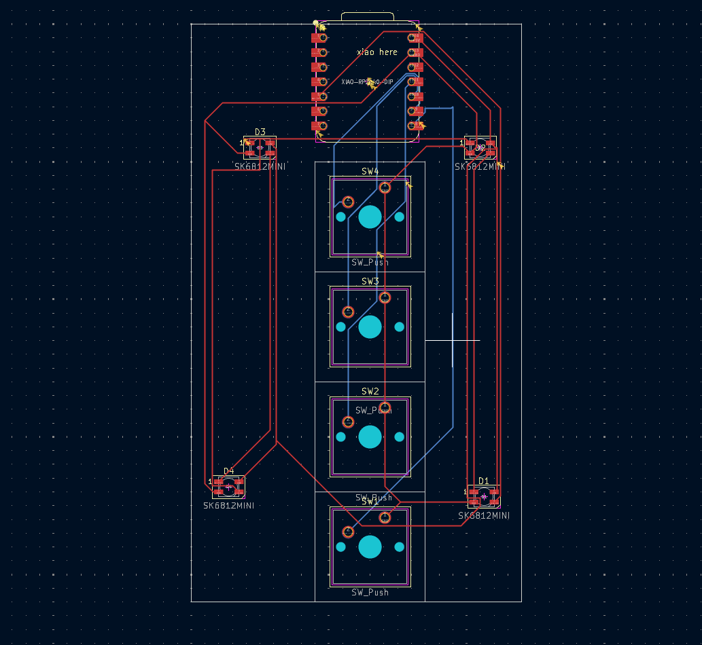
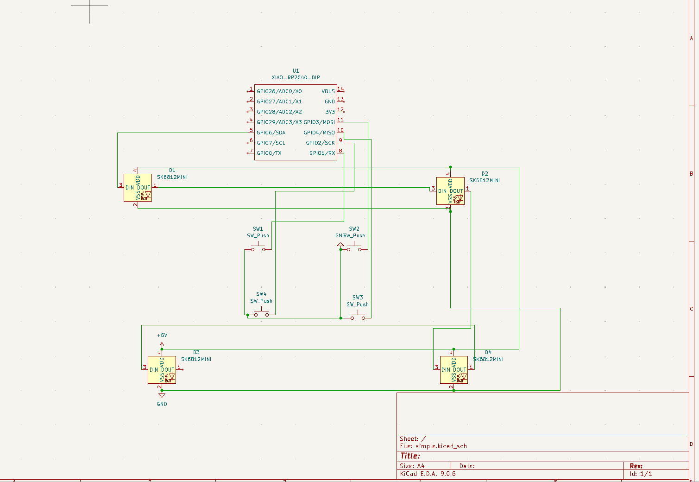
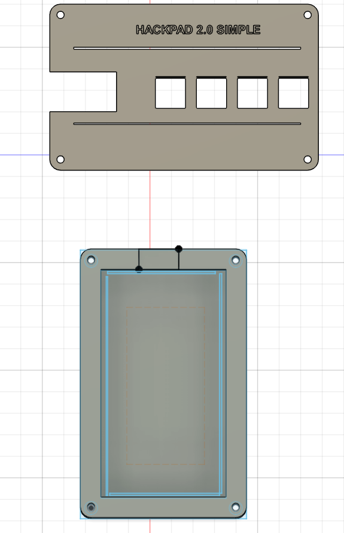
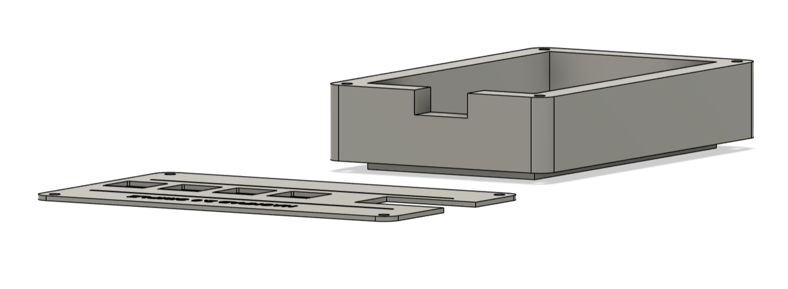

# ⌨️ Simple Hackpad

A custom 4-key macro pad designed for productivity and built with the **Seeed Studio XIAO RP2040**. This project uses **KMK Firmware** (CircuitPython) to handle custom keymaps and RGB lighting effects.

## 🛠️ Hardware
- **Controller:** Seeed Studio XIAO RP2040
- **Switches:** 4x Mechanical switches
- **Lighting:** SK6812 / WS2812B RGB LEDs
- **Design Tool:** KiCad 8.0

## 📸 Design Preview
Below are the design files for the PCB and the 3D model:

### PCB Layout

### Schematic

### 3D CAD View

### 3D CAD View

### 3D CAD View

## 💻 Firmware & Features
The firmware is built using **KMK**. It includes:
- **Custom Macros:** Configured for KiCad shortcuts and media controls.
- **RGB Screensaver:** A rainbow animation that activates to give the pad a "gaming" aesthetic.
- **CircuitPython:** Easy to edit on the fly by just saving the `code.py` file.

## 📁 Repository Structure
- `/firmware`: The `code.py` and configuration files for KMK.
- `/hardware`: KiCad schematic (`.kicad_sch`) and PCB (`.kicad_pcb`) files.
- `/pcb files`: Production-ready files.
- `/README-IMAGES`: Visuals used in this documentation.

## 🚀 About the Project
This project was built as part of the **Hack Club Blueprint** program. It helped me learn the end-to-end process of hardware design, from schematic entry and PCB routing to version control using Git and terminal commands.
